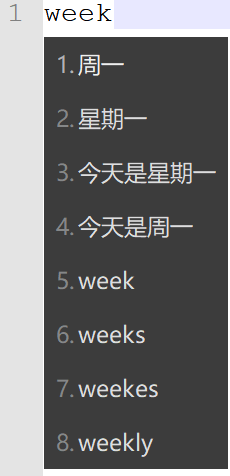
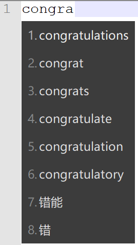

# RimeConfig

My Rime Config

## 方案选单


我使用的是 `小鹤双拼`

## 支持时间、星期、日期函数

输入 `time`、`week`、`date` 快速输入时间、星期、日期信息





## 支持 emoji 输入和联想，可以在配置文件中更改联想的对应文本

输入“开心”，能上屏对应emoji表情


## 支持英文输入



## 支持中英混合输入


## 注意事项

如果你是想要拷贝别人的或者我的配置文件，但注意不要拷贝覆盖 `installation.yaml` 和 `user.yaml` 这两个文件。

```yaml
distribution_code_name: Weasel
distribution_name: "小狼毫"
distribution_version: 0.14.3
install_time: "Thu Jun 24 11:23:44 2021"
installation_id: "dk-mechrevo"
rime_version: 1.5.3
sync_dir: 'C:\Users\dk\Nextcloud\RimeData\Rime'
```

`installation_id` 是你的设备唯一id，这个可以通过坚果云、nextcloud、dropbox来同步你的配置和词库信息。建议设置成自己设备的名称之类的。

`sync_dir` 是同步路径，已经通过坚果云、nextcloud等软件设定好的了本地同步路径。只要其中内容一发生更改就会触发双向同步。
